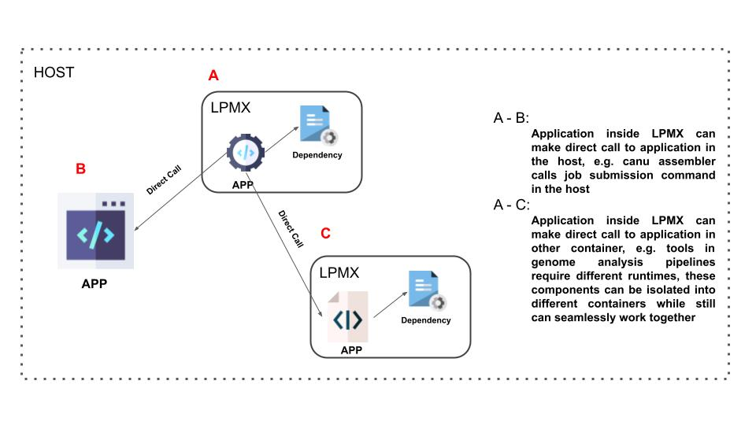

# LPMX     
LPMX, i.e, Local Package Manager X, is a **pure rootless composable** container system It allows users to create container runtimes based on Docker or Singularity (Experimental) images and install packages inside without root/sudo privilege required. 

Below is a basic demo of using LPMX:

# Features
1. **Pure rootless**, root privilege(root/sudo) is not required in any stages. It runs completely inside user space, which is especially suitable for creating and running software in a restricted environment such as Linux cluster, grid infrastructure, batch system and etc, where root privilege is not granted.
2. **Composability**, traditional container systems(Docker, Singularity, Podman) do not provide efficient communication channels for applications running on host and containers. For example, 'app A' running inside a container could not directly make a call to 'app B' running on host OS. However, LPMX is designed to provide this feature, which makes communication among applications running in different runtime environments become possible. Besides, by employing the composability feature, applications can be dynamically injected into the current container as if it is already installed locally, which can help integrate existing containers. 
2. **Understanding existing container image meta-data(Limited distros, e.g. Alpine Excluded)**, LPMX could create containers via Docker images available on docker hub. Currently ubuntu and centos series are supported. Besides, the latest release also has experimental support for the Singularity image, see wiki for more details.
3. **Userspace union file system(UUFS)**, LPMX implements its own simple userspace union file system, creating a union mount for different layers containing directories and files from different locations and forming a single coherent file system. Unlike other existing implementations, i.e, [fuse-overlayfs](https://github.com/containers/fuse-overlayfs) and etc, our userspace UFS does not require any pre-installation or bring modifications to host OS. It purely runs inside the userspace and can load Docker (Singularity) images without merging all layers. (This allows the system to share layers among different container instances without repeatedly uncompressing layers to establish root filesystem so the speed of creating containers will be fast!)
4. **Dynamic management of environmental variables**, LPMX allows end-users to set environment variables dynamically without stopping containers, all settings come into effect immediately.
5. **Designed for restricted runtime environment**, LPMX is designed for running containers in restricted runtime environments, such as root privilege is not approved or complete off-line usage. LPMX supports complete off-line initialization and deployment, which is especially suitable for scientific computing infrastructure.
6. **Easy to access GPGPU resource**, LPMX provides end-users an easy way to access the host GPGPU resource. An example is here [https://github.com/JasonYangShadow/lpmx/wiki/GPGPU](https://github.com/JasonYangShadow/lpmx/wiki/GPGPU)

# Composability Feature
Genome analysis tools are often difficult to install due to their complex dependencies and conflicts. 
Container virtualization systems such as Dockera and Singularity can help researchers install tools by isolating tools. However, they lack **composability**, an easy way to integrate multiple tools in different containers or multiple tools in a container and a host, which was an obstacle to benefit from container systems in research. An example is that tools that require distributed computing are not straightforward to be containerized. Another example is that a pipeline container integrating different tools or versions is difficult to build from existing containers.

The below video shows how to dynamically inject applications inside other LPMX containers into a current running LPMX container, you can see that even though applications, e.g. bwa, samtools, are not installed inside the currently running container, you can still inject them easily if they are already created via LPMX. This will greatly help integrate existing containers without repeated creation.

See [wiki](https://github.com/JasonYangShadow/lpmx/wiki) for more details.

# Examples
- Download and run newer ubuntu distros(ubuntu 14.04/16.04/18.04) on the host with old OS, such as centos 6, then install and run newer software inside.
- Package and deliver the current created environment to another machine.
- Run programs inside a container, and then make a direct call to other programs on the host.
- Get access to GPGPU resource easily by setting environment variables inside containers (/dev, /sys of the host are directly exposed to containers by default)

# Online Tutorial Session
If you are interested in LPMX and want an online tutorial session, please fill in this [Online Tutorial Request Form](https://forms.gle/6tUYdMmMSo6nDv916), I will contact you. (English will be used).

# A Tiny LPMX Manual
I have created a [tiny LPMX manual](https://github.com/JasonYangShadow/lpmx/wiki/LPMX%20Manual.pdf) containing figures and descriptions of the main features of LPMX, it will be updated at anytime.

You can also check the [wiki page](https://github.com/JasonYangShadow/lpmx/wiki)
# Quick Run
1. check out [release page](https://github.com/JasonYangShadow/lpmx/releases)
2. chmod a+x Linux-x86_64-lpmx && ./Linux-x86_64-lpmx init

# Compile LPMX 
1. Make sure golang and [dep](https://github.com/golang/dep) are installed on your OS
2. go get -v github.com/jasonyangshadow/lpmx
3. cd $GOPATH/src/github.com/jasonyangshadow/lpmx
4. ./build.sh

If there are any dependencies issues, try to execute 'dep ensure' inside the project folder and then add vendor subfolder into $GOROOT var.

# Compile Fakechroot
LPMX uses [customized fakechroot](https://github.com/jasonyangshadow/fakechroot) for trapping glibc functions(open, mkdir, symlink and etc), if you want to compile fakechroot, please refer this [Wiki](https://github.com/JasonYangShadow/lpmx/wiki#9-compile-fakechroot-and-its-dependencies-from-scratch)

# Important Notice

**Only several host OS and Docker images are supported currently**

Basically, LPMX supports centos/redhat (5.7, 6.7, 7) and ubuntu (12.04, 14.04, 16.04, 18.04, 19.04) as host OS. 

For more information please refer the project's wiki page. 

# Related Projects

- [Fakechroot](https://github.com/JasonYangShadow/fakechroot)
- [LPM](https://lpm.bio/)
- [udocker](https://github.com/indigo-dc/udocker)

# Acknowledgement
Computations were partially performed on the NIG supercomputer at ROIS National Institute of Genetics.

https://gc.hgc.jp
